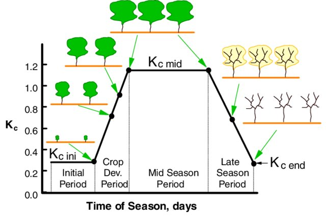

# Crop Configuration File
The crop configuration file defines **crop-specific growth stage** information, including **crop coefficients (Kc)** parameterized by days since planting. These coefficients are essential for estimating crop evapotranspiration in sDRIPS. Default values for major global crops are derived from established literature. A schematic diagram illustrating the progression of Kc values across crop growth stages, is shown below (adapted from  [Allen, R. & Pereira, L.. (2009)](https://www.researchgate.net/publication/225419080_Estimating_Crop_Coefficients_from_Fraction_of_Ground_Cover_and_Height)).


  
This configuration file is extensible, allowing users to **modify or add crops** to accommodate local varieties, new cultivars, or crops with unique growth cycles (e.g., short-duration, high-yielding varieties). This flexibility ensures that sDRIPS can remain relevant across diverse agroecological settings.

A snippet of a crop configuration file is shown below:
```yaml
# -------------------------------
# Crop configuration file
# -------------------------------

Rice:
  "0-20": 1.1
  "21-45": [linear, 1.1, 1.4, 25]
  "46-105": 1.4
  "106-115": [linear, 1.4, 1.0, 10]
  "116-140": 1.0

Wheat:
  "0-28": 0.5
  "29-56": [linear, 0.5, 1.15, 28]
  "57-112": 1.15
  "113-119": [linear, 1.15, 0.7, 7]
  "120-140": 0.7
  # Ref: https://www.researchgate.net/publication/4875041_Actual_evapotranspiration_and_crop_coefficients_of_wheat_Triticum_aestivum_under_varying_moisture_levels_of_humid_tropical_canal_command_area/figures?lo=1

```

## Adding a new crop to the existing configuration
To add a new crop, users should follow the syntax illustrated below.
```yaml
CropName:
"startDay-endDay": value                # Constant value
"startDay-endDay": [linear, startVal, endVal, duration]  # Linear progression over 'duration' days
- startVal: value at the beginning of the stage
- endVal: value at the end of the stage
- durationDays: number of days over which the value increases/decreases linearly
```
  
Example of adding a new crop:
```yaml
Crop_XXXX:
  "0-28": 0.51
  "29-56": [linear, 0.51, 1.29, 28]
  "57-112": 1.29
  "113-119": [linear, 1.29, 0.52, 7]
  "120-140": 0.52
```