# Getting Ready 

This guide covers the two required setups before using sDRIPS:  
1. **PPS (Precipitation Processing System)** - Required for downloading IMERG (Integrated Multi-satellitE Retrievals for GPM) precipitation data.   
2. **Google Earth Engine Account** - for processing and analyzing geospatial datasets.

## PPS Registration
PPS registration is necessary if users plan to utilize IMERG Precipitation data. Registration can be done by following the below steps.

Step 1:  
Click [here](https://registration.pps.eosdis.nasa.gov/registration/) to register on PPS platform for IMERG products.  

Step 2:  
Click on **Register** (highlighted in the screenshot below).  
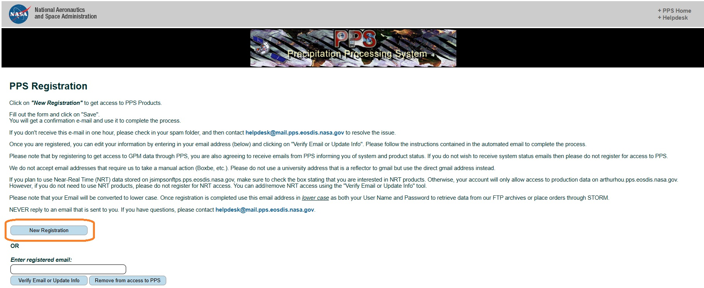

Step 3:  
Fill out the registration form shown below. Please make sure to check **'Near-Realtime Products'** (highlighted in the screenshot below).   
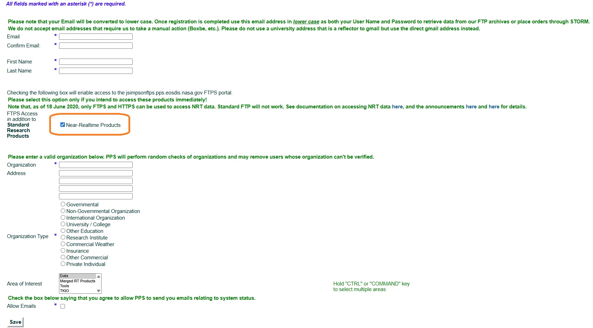  

Step 4:  
Click on Save. You will get a confirmation email and use that to complete the process.

Step 5:  
Copy and paste the PPS credentials in the secrets.yaml file under **IMERG_Account** section.
  
!!! success_note "Success"
    Your PPS account is now ready for IMERG downloads.

## Setup GEE
sDRIPS requires access to Google Earth Engine (GEE) for processing satellite data. You can choose between: 

- **Standard Account** - suitable for quick tests and manual runs.    

- **Service Account (Recommended)** - better for automation and operational workflows.    

Choice 1 : Choose Your Account Type (GEE Standard Account).   
Step 1:  
Go to [code.earthengine.google.com](code.earthengine.google.com).  

Step 2:  
If you don’t have a Google account, click 'create account', otherwise login with 
your Google account.  

Step 3:  
Earth Engine will now request access to your Google account, click 'allow'.  

Step 4:  
Click the link to go to the registration page, fill out the application and submit.  

Step 5:  
After you receive your 'Welcome to Google Earth Engine!' email, you will be 
able to login using your Google account on code.earthengine.google.com  

Step 6:    
Complete the following **tasks** in order.    

- [**Task 1**: Create a Google Cloud Project](#task1)  
- [**Task 4**: Register the Cloud Project with GEE](#task4)

!!! success_note "Success"
    Your standard GEE account is ready.  

Choice 2 : Choose Your Account Type (GEE Service Account).   
A Google Earth Engine (GEE) Service Account allows sDRIPS to run without requiring manual token renewals — a major advantage when moving from testing to continuous, automated operations. To set this up, you will:  

1. Create a Google Cloud Project ([Task 1](#task1)).
2. Enable the Earth Engine API for that project ([Task 2](#task2)).
3. Create and configure the Service Account ([Task 3](#task3)).
4. Register the Cloud Project with GEE ([Task 4](#task4))

Following the above tasks ensures your sDRIPS workflows can run reliably without manual authentication interruptions.  
 

Task 1 : Setting up a google cloud project.   
Step 1:  
Click [here](https://developers.google.com/earth-engine/cloud/earthengine_cloud_project_setup) to create a google cloud project. 

Step 2:  
Click on 'registration page', highlighted in orange box in the screenshot below.   
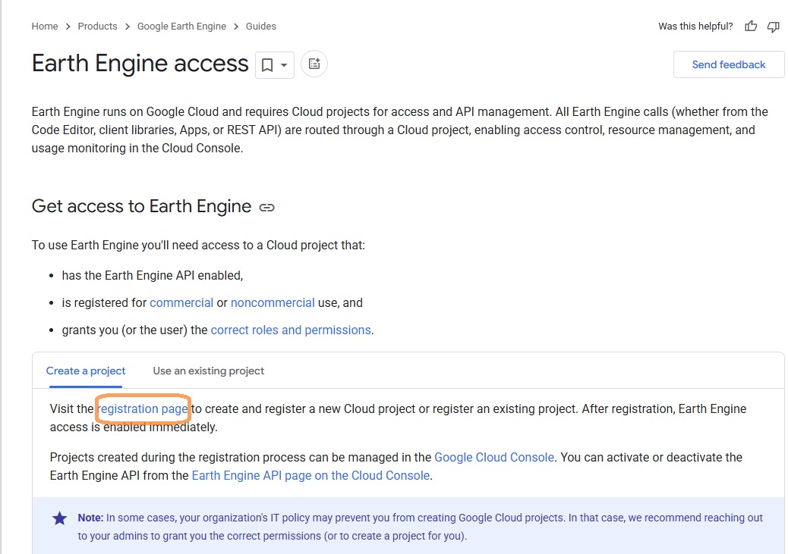

Step 3:  
Click on 'Register', highlighted in orange box in the screenshot below.   
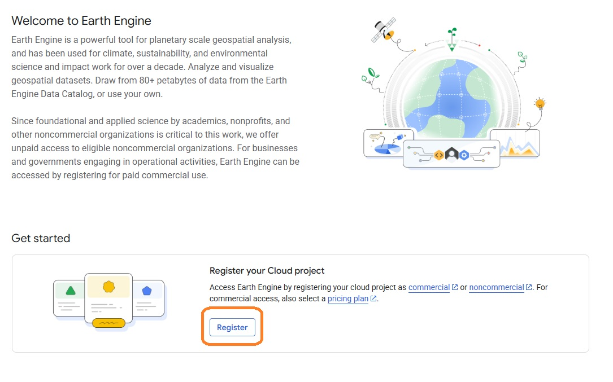

Step 4:  
Click on 'Create Project', highlighted in orange box in the screenshot below.   
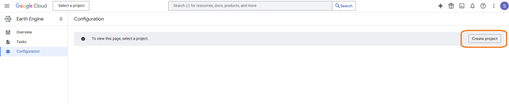

Step 5:  
Fill out the details on the page and click on 'Create Project'. For e.g, I have filled the project name as sDRIPS-RTD. You can leave the organisation.   
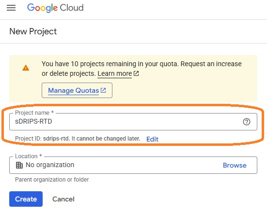
 

!!! success_note "Success"
    You just registered the project on GEE Cloud.

Task 2 : Enable Earth Engine API for the cloud project created.   
Step 1:  
Click on the hamburger icon left of the Google Cloud. Highligheted in orange box in the screenshot below. 
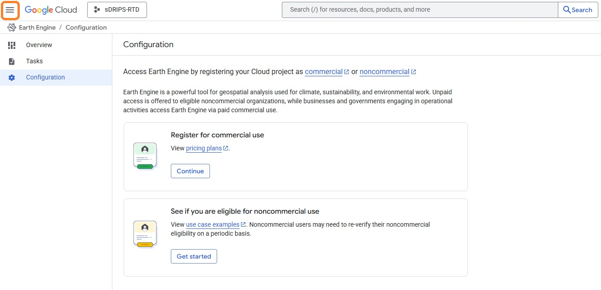

Step 2:  
Go to APIs & Sevices and click on 'Enabled APIs & Sevices' as shown in the highlighted orange box in the screenshot below. 
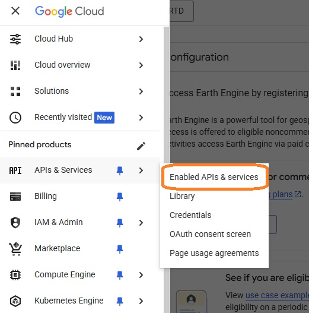  

Step 3:  
Click on 'Enabled APIs & Sevices' as shown in the highlighted orange box in the screenshot below.   
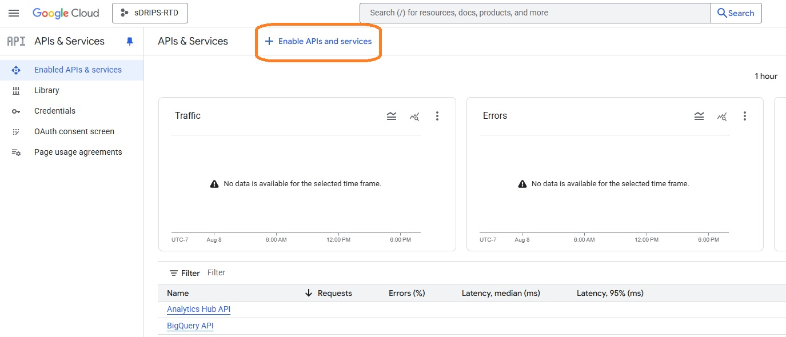

Step 4:  
Type 'Earth Engine' in the search bar as shown in the highlighted orange box in the screenshot below.   
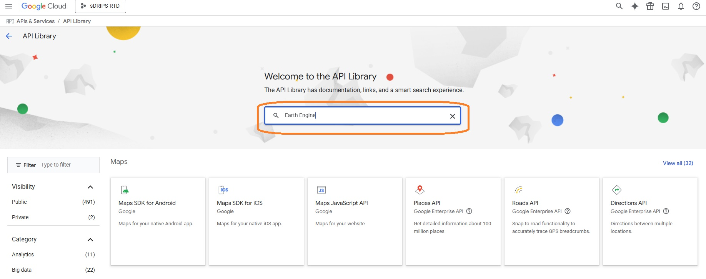

Step 5:  
Click on 'Google Earth Engine API' and click on 'Enable'. 
!!! success_note "Success"
    You just enabled Earth Engine API for your registered cloud project.

Task 3 : Setting up a service account.   
Step 1:  
For your registered cloud project click on the hamburger icon on the left of 'Google Cloud', select 'IAM & Admin' and click on 'Service Accounts' as shown in the highlighted orange box in the screenshot below.   
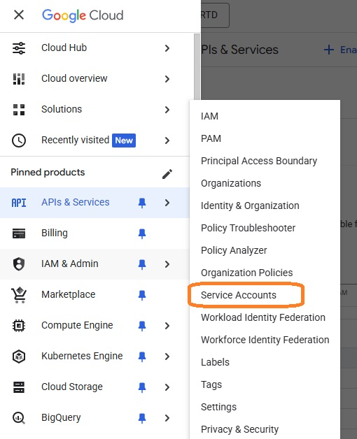

Step 2:  
Click on 'CREATE SERVICE ACCOUNT', make sure you have selected right google cloud project.   
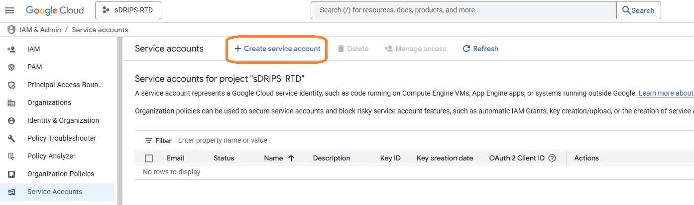

Step 3:  
Fill out the details in 'Service account name' and Click on 'CREATE AND CONTINUE'.       
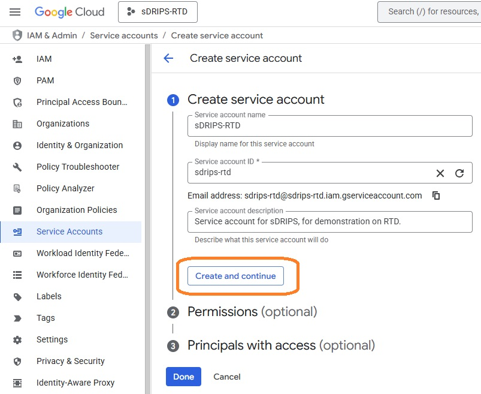

Step 4:  
In Permissions, under select role searcg for 'Earth Engine', and click on 'Earth Engine Resource Admin' for first role and then choose 'Service Usage Consumer' as another role. After selecting both roles, click on 'Continue'. And then click on 'Done'.   
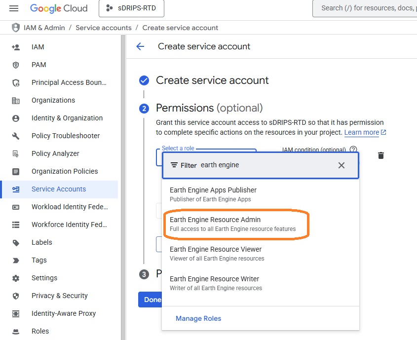

Step 5:  
Click on 'Actions' and then on 'Manage Keys' for the service account you created.   
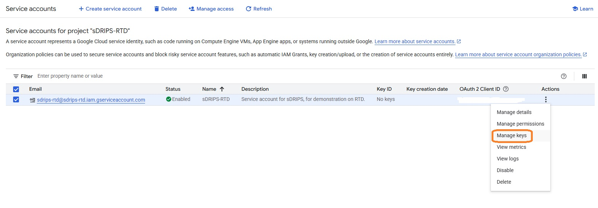

Step 6:  
Click on 'Add KEY' and then on 'Create new key' and select JSON, and save it in your project directory on local computer.   
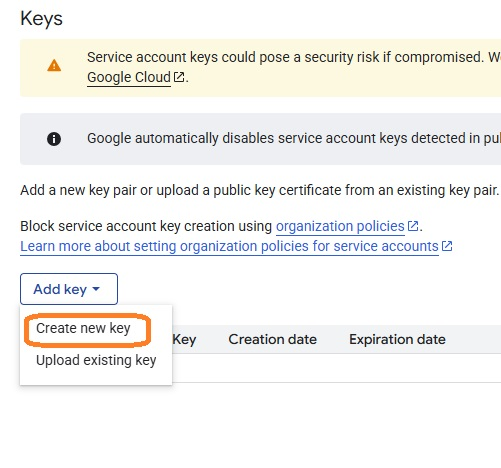

Task 4 : Register the Google Cloud project for Earth Engine use.   
Step 1:  
Click [here](https://developers.google.com/earth-engine) to register the created google cloud project to use earth engine API and sign-in using the user ID used to create cloud project, as shown in the orange highlighted box in the screen shot below.   
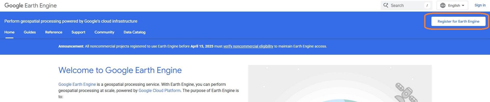

Step 2:  
Click on 'Register" as shown in the orange highlighted box in the screenshot below. Make sure that you have selected the correct project (for eg here it should be sDRIP-RTD), select the project through the purple highlighted box. Then click on 'Register a Noncommercial or Commercial Cloud project'.   
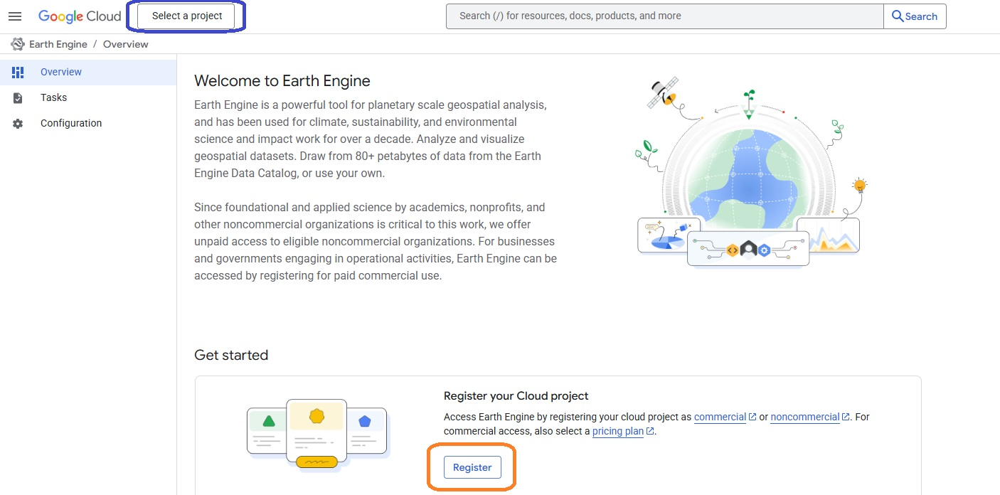  

Step 3:  
Check if you are eligible for non-commercial use by clicking on 'Get started' as shown in the orange highlighted box in the screenshot below.   
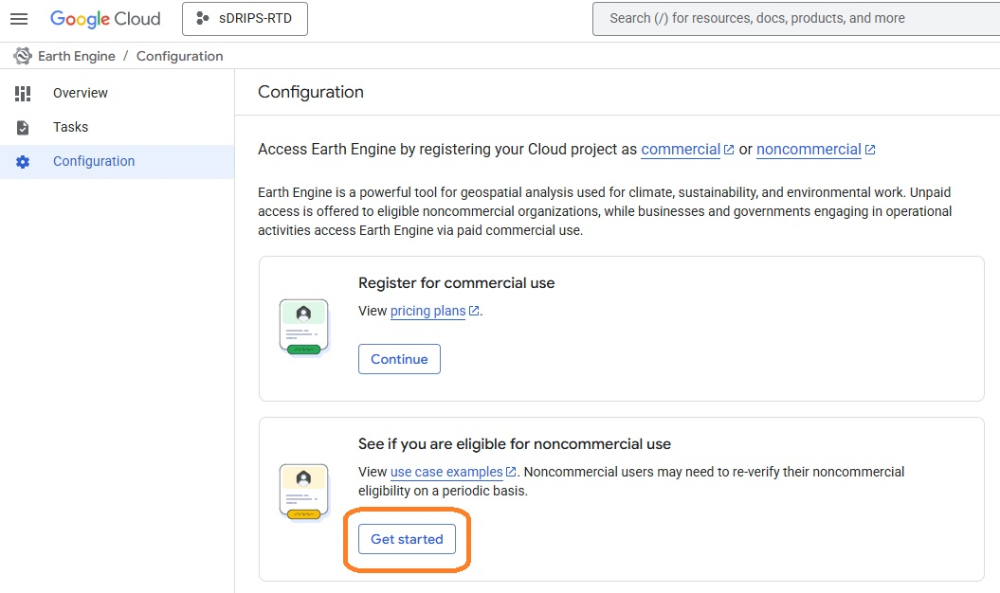

Step 4:  
Select either 'Public or Private instituition' or 'Nonprofit' as shown in the orange highlighted box in the screenshot below. After filling further details such as your instituition name, you should be eligible for non-commercial use of the GEE.   
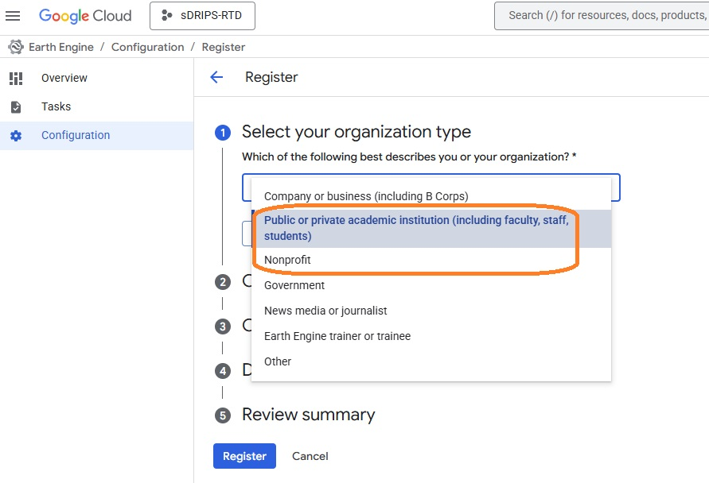

!!! success_note "Success"
    You just registered your cloud project (for service account) on GEE, and now you can use it for free.

## Summary Table

| Steps | PPS | GEE Standard | GEE Service Account |
|------|-----|--------------|---------------------|
| 1    | [Request PPS access](#pps_access) | [Create GEE standard account](#std_acc) | — |
| 2    | — | [Create Service Account](#task3) | [Create Google Cloud Project](#task1) |
| 3    | — | [Register Cloud Project for GEE](#task4) | [Enable Earth Engine API](#task1)|
| 4    | — | — | [Create Service Account](#task3) |
| 5    | — | — | [Register Cloud Project for GEE](#task4) |